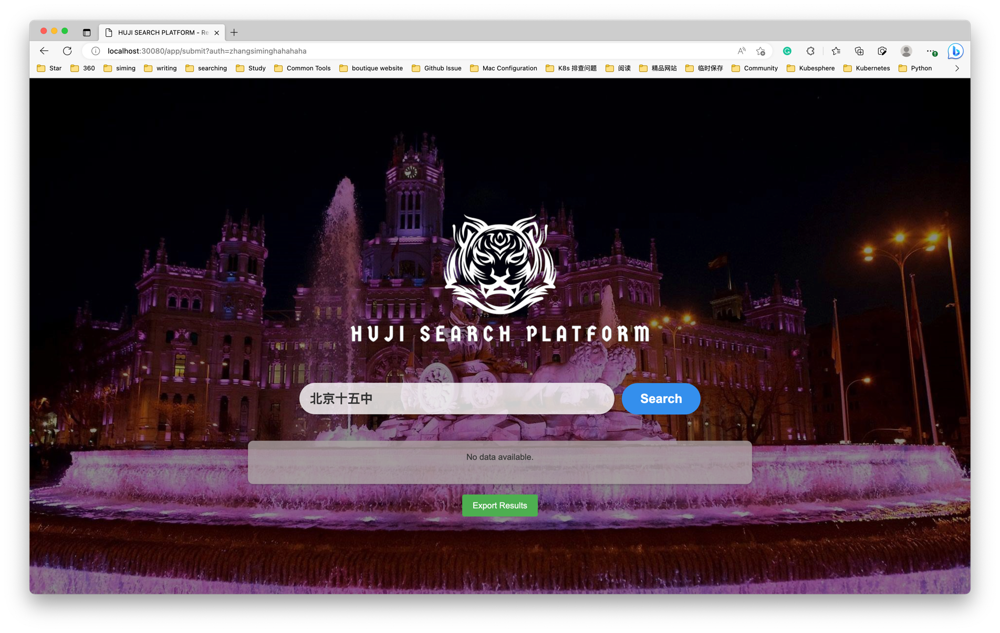
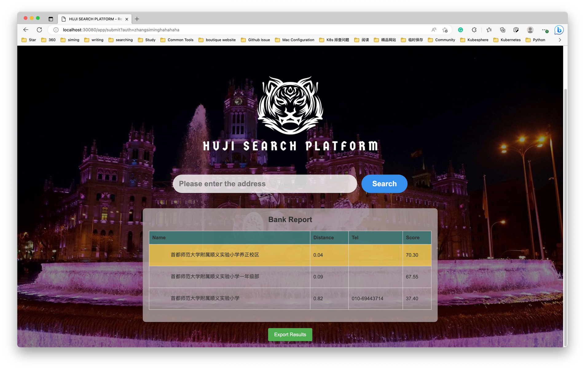
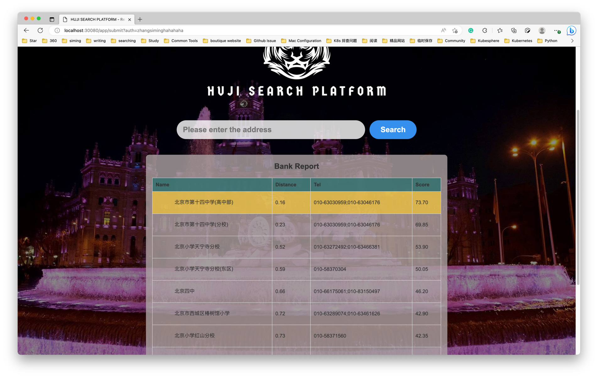
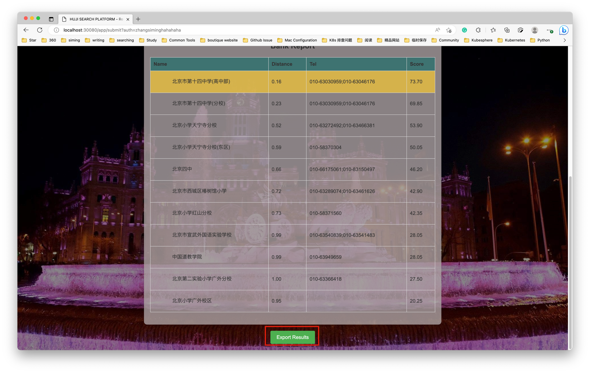

# HUJI Search Platform

## Introduction

The HUJI Search Platform, given that name by one of my friends, is a tool for searching a topic and returning results that are close by. It is especially useful when looking for a certain topic across a big area. You can use this platform, for instance, to locate the closest restaurant in a city if you want to find a place to eat there.

Additionally, it allows for the input of two destinations and returns results that are close to both sources. When trying to discover the ideal location to meet two destinations, it is quite helpful.
Its coding logic interacts with Amap's API and includes a scoring mechanism to rate the results.

Keep in mind that this is just a very basic site example; you can fork it to expand your feature. And don't hesitate to ask if there is anything I can do to assist. Help you enjoy your day!

## Installation

A golang 1.18 or later environment is required in order to install the HUJI Search Platform.
With that, you can literally use the following command to build it:

```bash
make build
```

### Support environment variables

| variable | meaning                                                                                                                              | default            |
|----------|--------------------------------------------------------------------------------------------------------------------------------------|--------------------|
| KEYWORD  | The topic you want, for example 学校，银行，游乐场                                                                                            | 银行                 |
| DISTANCE | The longer the search radius, the more results will be returned                                                                    | 1000 unit is meter |
| AMAPKEY  | Amap key, got from https://console.amap.com/dev/index, don't have a default value and you must specify it before running your binary ||

Once the build and environment are complete, you can execute the binary to launch the server:

```bash
export KEYWORD=银行
export DISTANCE=1000
export AMAPKEY=yourkey
./banklocator
```

Consequently, HUJI Search Platform will by default serve at 30080.

## Usage

Assuming your HUJI Search Platform is up and running, you can access the following URL to view the login page:

http://localhost:30080

### Authentication

press "admin" to login in(don't complain about the security, it's just a demo)


### Search with single destination

When you enter the desired location and click the search icon, the results will appear in the table below.

Example:



Result:



### Search with multiple destinations

Here is an illustration of a two-destination search. After entering two locations(separated by comma) and pressing the search icon, the outcomes will show up in the chart below.

Example:


Result:



### Export your result

You can export your result by press the export button, this will automatically trigger a new tab to download a csv file.



## License

[MIT](https://choosealicense.com/licenses/mit/)  

**Contact me**: 1030728296@qq.com
